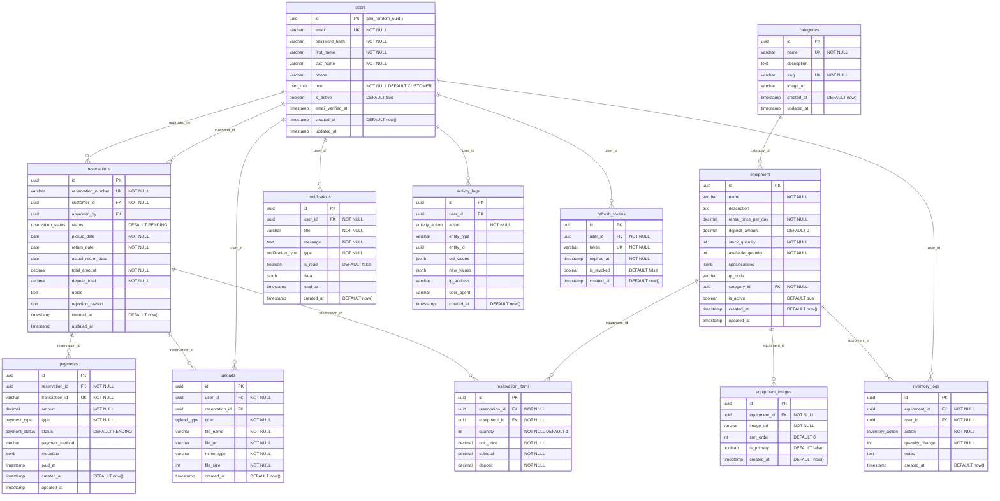

# Database Design Document — Equipment Rental Management Platform

> **Document Version**: 1.0  
> **Last Updated**: 2026-07-29  
> **Database**: PostgreSQL 16  
> **ORM**: Prisma

---

## Entity Relationship Diagram



---

## Enum Definitions

### `user_role`
```sql
CREATE TYPE user_role AS ENUM ('ADMIN', 'STAFF', 'CUSTOMER', 'WAREHOUSE');
```

### `reservation_status`
```sql
CREATE TYPE reservation_status AS ENUM ('PENDING', 'APPROVED', 'REJECTED', 'ACTIVE', 'RETURNED', 'CANCELLED');
```

### `payment_type`
```sql
CREATE TYPE payment_type AS ENUM ('RENTAL', 'DEPOSIT', 'REFUND', 'DAMAGE');
```

### `payment_status`
```sql
CREATE TYPE payment_status AS ENUM ('PENDING', 'PAID', 'FAILED', 'REFUNDED');
```

### `inventory_action`
```sql
CREATE TYPE inventory_action AS ENUM ('RECEIVED', 'RELEASED', 'DAMAGED', 'MAINTENANCE', 'ADJUSTMENT');
```

### `notification_type`
```sql
CREATE TYPE notification_type AS ENUM ('RESERVATION_APPROVED', 'RESERVATION_REJECTED', 'UPCOMING_RETURN', 'RESERVATION_EXPIRED');
```

### `upload_type`
```sql
CREATE TYPE upload_type AS ENUM ('IDENTITY_DOCUMENT', 'RENTAL_AGREEMENT', 'EQUIPMENT_IMAGE');
```

### `activity_action`
```sql
CREATE TYPE activity_action AS ENUM ('LOGIN', 'LOGOUT', 'REGISTER', 'RESERVATION_CREATED', 'RESERVATION_UPDATED', 'PAYMENT', 'INVENTORY_CHANGE', 'EQUIPMENT_CREATED', 'EQUIPMENT_UPDATED', 'EQUIPMENT_DELETED');
```

---

## Table Details

### 1. `users`

| Column | Type | Constraints | Notes |
|--------|------|-------------|-------|
| id | UUID | PK, DEFAULT gen_random_uuid() | |
| email | VARCHAR(255) | UNIQUE, NOT NULL | Lowercase, trimmed |
| password_hash | VARCHAR(255) | NOT NULL | bcrypt hash |
| first_name | VARCHAR(100) | NOT NULL | |
| last_name | VARCHAR(100) | NOT NULL | |
| phone | VARCHAR(20) | | Optional |
| role | user_role | NOT NULL, DEFAULT 'CUSTOMER' | |
| is_active | BOOLEAN | DEFAULT true | Soft deactivation |
| email_verified_at | TIMESTAMP | | NULL until verified |
| created_at | TIMESTAMP | DEFAULT now() | |
| updated_at | TIMESTAMP | | Auto-updated |

**Indexes:**
- `idx_users_email` UNIQUE on `email`
- `idx_users_role` on `role`
- `idx_users_is_active` on `is_active`

---

### 2. `categories`

| Column | Type | Constraints | Notes |
|--------|------|-------------|-------|
| id | UUID | PK | |
| name | VARCHAR(100) | UNIQUE, NOT NULL | |
| description | TEXT | | |
| slug | VARCHAR(100) | UNIQUE, NOT NULL | URL-friendly name |
| image_url | VARCHAR(500) | | Category icon/image |
| created_at | TIMESTAMP | DEFAULT now() | |
| updated_at | TIMESTAMP | | |

**Indexes:**
- `idx_categories_slug` UNIQUE on `slug`

---

### 3. `equipment`

| Column | Type | Constraints | Notes |
|--------|------|-------------|-------|
| id | UUID | PK | |
| name | VARCHAR(255) | NOT NULL | |
| description | TEXT | | |
| rental_price_per_day | DECIMAL(10,2) | NOT NULL, CHECK > 0 | |
| deposit_amount | DECIMAL(10,2) | DEFAULT 0, CHECK >= 0 | |
| stock_quantity | INT | NOT NULL, CHECK >= 0 | Total inventory count |
| available_quantity | INT | NOT NULL, CHECK >= 0 | Currently available |
| specifications | JSONB | | Key-value specs |
| qr_code | VARCHAR(500) | | QR code data/URL |
| category_id | UUID | FK → categories(id), NOT NULL | |
| is_active | BOOLEAN | DEFAULT true | |
| created_at | TIMESTAMP | DEFAULT now() | |
| updated_at | TIMESTAMP | | |

**Constraints:**
- `CHECK (available_quantity <= stock_quantity)`
- `CHECK (rental_price_per_day > 0)`
- `CHECK (deposit_amount >= 0)`

**Indexes:**
- `idx_equipment_category_id` on `category_id`
- `idx_equipment_is_active` on `is_active`
- `idx_equipment_name` on `name` (for search)
- `idx_equipment_availability` on `(is_active, available_quantity)` (composite for availability checks)

---

### 4. `equipment_images`

| Column | Type | Constraints | Notes |
|--------|------|-------------|-------|
| id | UUID | PK | |
| equipment_id | UUID | FK → equipment(id) ON DELETE CASCADE | |
| image_url | VARCHAR(500) | NOT NULL | R2 URL |
| sort_order | INT | DEFAULT 0 | Display ordering |
| is_primary | BOOLEAN | DEFAULT false | Thumbnail image |
| created_at | TIMESTAMP | DEFAULT now() | |

**Indexes:**
- `idx_equipment_images_equipment_id` on `equipment_id`

---

### 5. `reservations`

| Column | Type | Constraints | Notes |
|--------|------|-------------|-------|
| id | UUID | PK | |
| reservation_number | VARCHAR(20) | UNIQUE, NOT NULL | e.g., RES-20260729-001 |
| customer_id | UUID | FK → users(id), NOT NULL | |
| approved_by | UUID | FK → users(id) | Staff who approved |
| status | reservation_status | DEFAULT 'PENDING' | |
| pickup_date | DATE | NOT NULL | |
| return_date | DATE | NOT NULL | |
| actual_return_date | DATE | | Set on return |
| total_amount | DECIMAL(12,2) | NOT NULL | |
| deposit_total | DECIMAL(12,2) | NOT NULL | |
| notes | TEXT | | Customer/staff notes |
| rejection_reason | TEXT | | If rejected |
| created_at | TIMESTAMP | DEFAULT now() | |
| updated_at | TIMESTAMP | | |

**Constraints:**
- `CHECK (return_date > pickup_date)`
- `CHECK (total_amount >= 0)`
- `CHECK (deposit_total >= 0)`

**Indexes:**
- `idx_reservations_customer_id` on `customer_id`
- `idx_reservations_status` on `status`
- `idx_reservations_dates` on `(pickup_date, return_date)` (composite for date range queries)
- `idx_reservations_reservation_number` UNIQUE on `reservation_number`

---

### 6. `reservation_items`

| Column | Type | Constraints | Notes |
|--------|------|-------------|-------|
| id | UUID | PK | |
| reservation_id | UUID | FK → reservations(id) ON DELETE CASCADE | |
| equipment_id | UUID | FK → equipment(id) | |
| quantity | INT | NOT NULL, DEFAULT 1, CHECK > 0 | |
| unit_price | DECIMAL(10,2) | NOT NULL | Price at time of reservation |
| subtotal | DECIMAL(12,2) | NOT NULL | unit_price × quantity × days |
| deposit | DECIMAL(10,2) | NOT NULL | deposit_amount × quantity |

**Indexes:**
- `idx_reservation_items_reservation_id` on `reservation_id`
- `idx_reservation_items_equipment_id` on `equipment_id`
- `UNIQUE (reservation_id, equipment_id)` — prevent duplicate items

---

### 7. `payments`

| Column | Type | Constraints | Notes |
|--------|------|-------------|-------|
| id | UUID | PK | |
| reservation_id | UUID | FK → reservations(id) | |
| transaction_id | VARCHAR(50) | UNIQUE, NOT NULL | e.g., TXN-uuid-short |
| amount | DECIMAL(12,2) | NOT NULL, CHECK > 0 | |
| type | payment_type | NOT NULL | |
| status | payment_status | DEFAULT 'PENDING' | |
| payment_method | VARCHAR(50) | | e.g., "credit_card", "bank_transfer" |
| metadata | JSONB | | Additional payment data |
| paid_at | TIMESTAMP | | Set when status = PAID |
| created_at | TIMESTAMP | DEFAULT now() | |
| updated_at | TIMESTAMP | | |

**Indexes:**
- `idx_payments_reservation_id` on `reservation_id`
- `idx_payments_status` on `status`
- `idx_payments_transaction_id` UNIQUE on `transaction_id`

---

### 8. `inventory_logs`

| Column | Type | Constraints | Notes |
|--------|------|-------------|-------|
| id | UUID | PK | |
| equipment_id | UUID | FK → equipment(id) | |
| user_id | UUID | FK → users(id) | Warehouse user |
| action | inventory_action | NOT NULL | |
| quantity_change | INT | NOT NULL | Positive or negative |
| notes | TEXT | | |
| created_at | TIMESTAMP | DEFAULT now() | |

**Indexes:**
- `idx_inventory_logs_equipment_id` on `equipment_id`
- `idx_inventory_logs_created_at` on `created_at`

---

### 9. `notifications`

| Column | Type | Constraints | Notes |
|--------|------|-------------|-------|
| id | UUID | PK | |
| user_id | UUID | FK → users(id) | |
| title | VARCHAR(255) | NOT NULL | |
| message | TEXT | NOT NULL | |
| type | notification_type | NOT NULL | |
| is_read | BOOLEAN | DEFAULT false | |
| data | JSONB | | Additional context |
| read_at | TIMESTAMP | | |
| created_at | TIMESTAMP | DEFAULT now() | |

**Indexes:**
- `idx_notifications_user_id_is_read` on `(user_id, is_read)` (composite for unread count)
- `idx_notifications_created_at` on `created_at`

---

### 10. `uploads`

| Column | Type | Constraints | Notes |
|--------|------|-------------|-------|
| id | UUID | PK | |
| user_id | UUID | FK → users(id) | |
| reservation_id | UUID | FK → reservations(id) | Nullable |
| type | upload_type | NOT NULL | |
| file_name | VARCHAR(255) | NOT NULL | Original filename |
| file_url | VARCHAR(500) | NOT NULL | R2 URL |
| mime_type | VARCHAR(100) | NOT NULL | |
| file_size | INT | NOT NULL | Bytes |
| created_at | TIMESTAMP | DEFAULT now() | |

**Indexes:**
- `idx_uploads_user_id` on `user_id`
- `idx_uploads_reservation_id` on `reservation_id`

---

### 11. `activity_logs`

| Column | Type | Constraints | Notes |
|--------|------|-------------|-------|
| id | UUID | PK | |
| user_id | UUID | FK → users(id) | Nullable for system actions |
| action | activity_action | NOT NULL | |
| entity_type | VARCHAR(50) | | e.g., "reservation", "equipment" |
| entity_id | UUID | | ID of affected entity |
| old_values | JSONB | | Previous state |
| new_values | JSONB | | New state |
| ip_address | VARCHAR(45) | | IPv4/IPv6 |
| user_agent | VARCHAR(500) | | |
| created_at | TIMESTAMP | DEFAULT now() | |

**Indexes:**
- `idx_activity_logs_user_id` on `user_id`
- `idx_activity_logs_action` on `action`
- `idx_activity_logs_entity` on `(entity_type, entity_id)` (composite)
- `idx_activity_logs_created_at` on `created_at`

---

### 12. `refresh_tokens`

| Column | Type | Constraints | Notes |
|--------|------|-------------|-------|
| id | UUID | PK | |
| user_id | UUID | FK → users(id) ON DELETE CASCADE | |
| token | VARCHAR(500) | UNIQUE, NOT NULL | Hashed token |
| expires_at | TIMESTAMP | NOT NULL | |
| is_revoked | BOOLEAN | DEFAULT false | |
| created_at | TIMESTAMP | DEFAULT now() | |

**Indexes:**
- `idx_refresh_tokens_token` UNIQUE on `token`
- `idx_refresh_tokens_user_id` on `user_id`
- `idx_refresh_tokens_expires` on `(is_revoked, expires_at)` (composite for cleanup)

---

## Seed Data

The database should be seeded with the following sample data:

### Users (4)
| Email | Role | Password |
|-------|------|----------|
| admin@rental.com | ADMIN | Admin@123 |
| staff@rental.com | STAFF | Staff@123 |
| warehouse@rental.com | WAREHOUSE | Warehouse@123 |
| customer@rental.com | CUSTOMER | Customer@123 |

### Categories (6)
| Name | Slug |
|------|------|
| Camera Gear | camera-gear |
| Drones | drones |
| Audio Equipment | audio-equipment |
| Construction Tools | construction-tools |
| Lighting | lighting |
| Power Tools | power-tools |

### Equipment (12+)
A mix of items across all categories with varying prices, deposits, and stock levels.

### Sample Reservations (5+)
Reservations in various statuses (pending, approved, active, returned, cancelled) with associated items, payments, and notifications.
